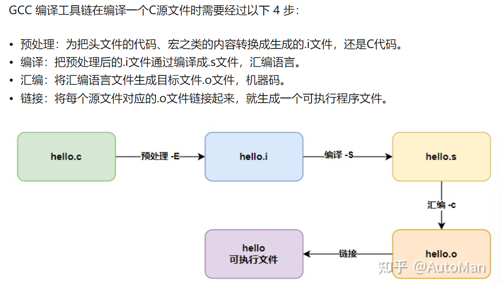
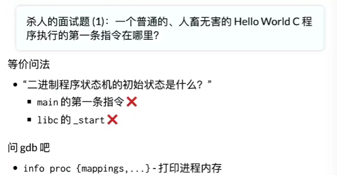
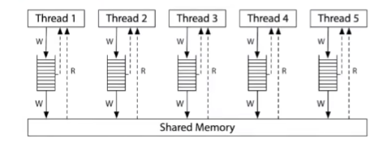
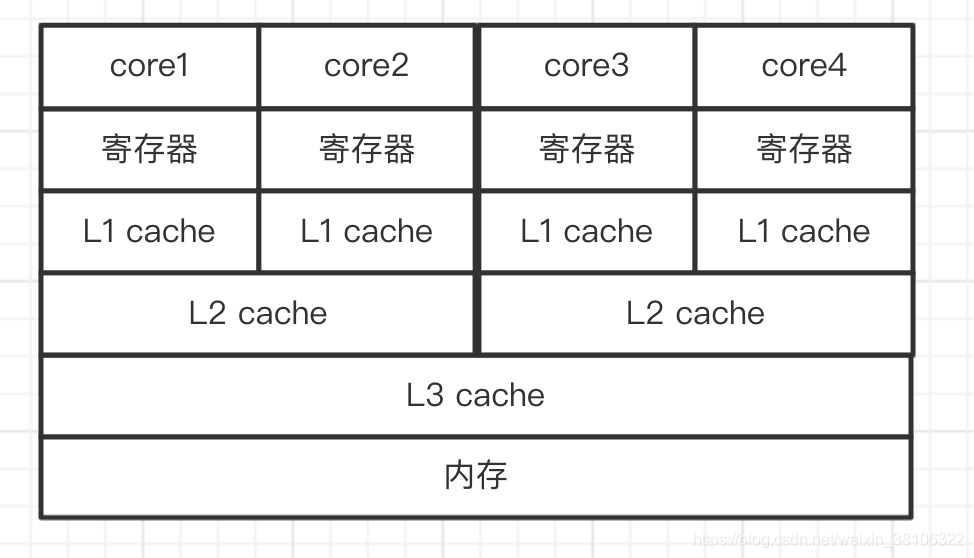
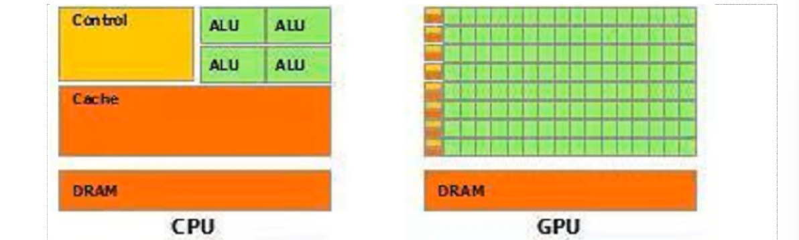
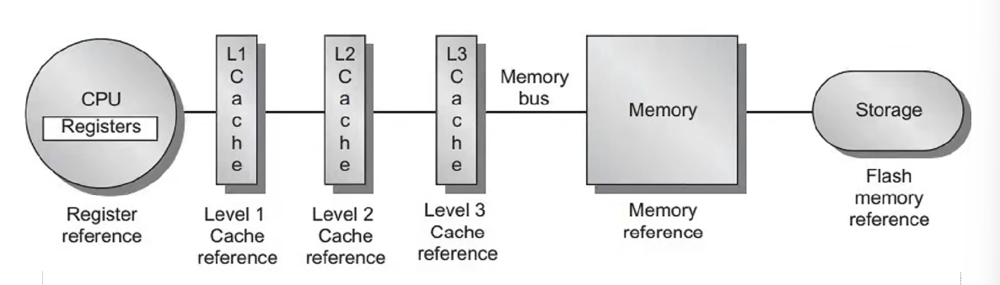

# Lecture1

## why

从应用再抽象

OS给APP提供了什么API

完全错误的toolchain，调试全靠蛮力和猜。正确的时候接收正确的训练

学的有劲求知欲就行了，笔记只为整理思路

## what

让应用共享内存、和设备交互

一个定义滴水不漏的时候就没什么用了，精准的定义毫无意义。操作系统如何从一开始变成了现在这样？

计算机（硬件）、程序（软件）、操作系统（管理软件的软件）

操作系统：管理资源  提供服务！

### 1940s

逻辑门：真空电子管。但它无法做SRAM，延迟线内存，不断循环达到存储数据，一维内存

输入输出：纸袋打孔


最早的程序：数值计算微分积分，这几个程序用指令在计算机上打孔就行，不用管理程序。程序直接操作硬件，不需要OS抽象硬件

### 1950s

更快更小的逻辑门（晶体管）、更大的内存（磁芯，二维内存）、丰富的IO设备。此时IO速度严重低于处理器速度，于是有了中断

可以执行更复杂的任务、通用的任务，越来越多人使用计算机希望调用API而不是直接调用硬件

fortran    一行代码，在正确的地方打孔。打孔

才要流程图，不然打不出孔。现在的IDE各种代码可视化根本不需要流程图

那个年代，一个学校只有一台计算机还是单核的，有好多系的好多程序需要跑。程序是Fortran打孔的卡片，现在有好多个卡片但就一台计算机，OS一定有管理的卡片堆叠器，可以实现批处理（程序自动换卡+API）

文件，即有了输出。一个卡片程序算完了输出到另一个卡片。

### 1960s

有了大内存，之前的小内存里面只能放一个内存，现在可以内存放好几个程序。两个程序载入内存但只有一个CPU，开始可以把CPU被IO的阻塞时的空闲时间利用起来，即进程切换、多道程序（内存里的动的程序即进程）。

此时需要更多的硬件实现多道程序，进程间内存需要隔离避免访问别的程序内存时破坏了别的程序内存

有了中断，进一步一步到位可以时钟中断   multics的多用户间分时还是太超前了

### 1970s

分时系统也成熟了，C语言也有了，集成电路也突飞猛进

UNIX诞生也完善（做好单用户），信号API、管道、grep，GNU做Unix上层的应用程序

### 今天

虚拟化硬件资源，为程序运行提供服务。软件变得复杂，硬件也变得复杂

现在有更复杂的处理器和内存，非对称多处理器（大核小核）、每个CPU访问每个DRAM的时间不一样

## 三个基本问题

1. OS服务谁

   程序=状态机

2. 为程序提供什么服务

   对象+API

3. 如何实现OS提供的服务

   OS=C程序，初始化后成为中断处理器

## HOW？

1. 是一个合格的操作系统用户
   - 会STFW/RTFM自己搜索动手解决问题
   - 不怕使用任何命令行工具
     vim, tmux, grep, gcc, binutils, ..
   
2. 不惧怕写代码
   
     - 能管理一定规模(数千行)的代码
     - 能在出bug时默念“机器永远是对的、我肯定能调出来的”
       - 然后开始用正确的工具/方法调试
     
3. Linux难用？Power User

     1. 建立信心，并理解基本逻辑

     2. 没有找对材料(Baidu v.s. Google/Bing/Github/StackOverflow)

     3. 没有用对工具(man v.s. tldr；该用IDE就别Vim)

4. 命令行+浏览器就是世界

     不需要语言特性、设计模式，写就行了！代码量大了自然而然就会需要他们

# Lecture2

X-MACRO 是一种**可靠维护代码或数据的并行列表的技术**，其相应项必须以相同的顺序出现。

gcc -E宏展开

/a.out>seven-seg.py。命令用管道连起来，一个的输出作为另一个的输入

数字系统本身就是状态机，00-01-10-11

状态机每个语句都是简单语句，执行一个语句，堆栈就变了

- gdb

  s，info frame

  si  下一步   从信息流中出来，学习思考就不可进入切换挪过来

- 状态，就是内存里变量的状态。x的值是状态的一部分，函数调用函数返回有新的栈帧那这个状态怎么算？每个栈帧有形参、局部变量、PC

  函数调用有新的栈帧创建新的状态插入并且PC=0，函数调用的返回就是把顶上的栈帧删了状态回归

  所有的概念可以变成代码时，就是掌握了这个概念

- 栈帧模型，变量+PC（内存里的状态），c代码（volatile不可优化）

  二进制数模型，寄存器里的数，汇编代码

- 系统调用syscall

  状态机视角的程序，就是计算->算完syscall系统调用，关闭这个进程或者让系统调用给到自己其他进程的资源，或者清屏，显示数到IO屏幕->计算。由一系列可优化部分和不可优化部分组成

- 正确的编译

  只要在内存屏障volatile外的都能优化

  `gcc -c a.c $$ objdump -d a.o` objdump反汇编，**可以对.o目标文件(每一个源文件都对应一个目标文件)或.out可执行文件**（每个源文件对应的目标.o文件链接起来，就生成一个可执行程序文件。例如一个工程里包含了A和B两个代码文件，在链接阶段， 链接过程需要把A和B之间的函数调用关系理顺，也就是说要告诉A在哪里能够调用到fun函数， 建立映射关系），-o只是重命名    -c得到的.o目标文件，直接gcc得到的是.out

  搜索是/xxx

  想看二进制，就用:%!xxd     vim cat xxd

  如果在插入模式要到底行模式，需要先按esc回到普通模式,在按：到底行模式；如果在底行模式需要到普通模式可以按两下esc。`:!gcc % -lpthread && ./a.out`  %是当前

  

  常量传播、死代码消除....来回迭代rewriting，

  证明程序的等价性后，程序合成。AIrewriting

  PL  programming language

- 应用看到的操作系统就是syscall，但操作系统里由很多对象，都通过syscall访问（软硬件通过OS管理，而不能直接应用程序操作软硬件，不然就像屏幕 花了）

  coreutils最基本的核心工具  cat echo等在里面

  在此之上，由bash、binutils、apt、ip、ssh、vim、tmux、jdk、python。**这些系统工具都是一样的状态机模型：计算+系统调用**



gdb a.out     starti(需要是个带main的可执行文件，没有main根本无法链接成.out)     info proc mappings  进程有OS的初始状态   就是GDB说的/lib64/ld-linux-x86-64.so.2   这是加载器，加载了libc（main的开始结束不是程序的开始结束）  可以在二进制文件里改二进制 就会第一步执行别的程序，但这时就执行不了了   但可以用链接ln

找到程序执行用了那些系统调用  用strace工具（追踪到程序执行时所有调用）

strace ./a.out  需要是路径    出来的全是系统调用   所有的程序都是被execve加载的，所以第一条系统调用就是这个

strace -f gcc a.c  用strace看编译器怎么完成编译过程

- 程序=状态机=计算→syscall→计算→
  - 被操作系统加载
    - 通过另一个进程执行execve设置为初始状态
  - 状态机执行
      - 进程管理: fork, execve, exit, ..
      - 文件/设备管理: open, close, read, write, ...
      - 存储管理: mmap, brk, ...
  - 直到_exit (exit_group)退出

没必要不允许不同的声音  认知不同罢了   我喜欢炫 

终端分屏    tmux

# Lecture3

上一节的状态机模型是单线程，如何变成多线程？并发程序的状态机模型

并发有非确定性

共享内存的多个执行流。有共享的一片空间，然后线程链，每个线程都有PC，状态外面有switcher，状态可以选择T1/T2哪个来执行，也就有了不确定性

并发的状态机，就成了类似多叉树，每个节点内部是共享+几条线程链

多线程的程序，就算代码上写的有先后顺序，但是两个是不定顺序并发执行

gcc b.c -lpthread  //这个编译选项是引入的包里的？  它编译完都是a.out！

不同的线程是不是在一个地址空间？在的话虽然有独立地址但却可以看到别人了，当然共享空间是一定的

每个线程有个threadLocalStorage    看到一个线程栈8192  那应该就是一页4096   一个线程两页：


两个线程同时访问一个红黑树、链表，还能对吗？内存模型，变量并不是立即发生变化的，必须要**原子性**！程序执行都是有施法时间的，除非一开始就关门，lock和unlock间的区域绝对区域化！**99%的并发问题可以用一个队列解决**

` while true;./a.out;end`这个我的执行不了，` while true;do ./a.out;done`shell可以这么写，就是一行的shell脚本。就能一直循环执行这个多线程的程序了

双线程的sum100000000求和程序，根本无法求出200000000，永远在110000000上下

如果用汇编   那也得`asm volatile("lock add $1,%0":"+m"(sum));`有个lock才行

`man 3 printf `  3是库函数,如printf,fread   /thread  就能搜到是线程安全的

编译器对内存是最终一致性，只记录内存最终写入的

 gcc -c -O1 sum.c &&objdump -d sum.o  

#include ""  是先从当前文件夹查找路径  找到了覆盖标准库目录的结果，找不到再去标准库目录

#include<>是直接去系统目录找

volatile避免编译器优化顺序（有序性）

GCC定义了许多不同的非标准[function attributes](http://gcc.gnu.org/onlinedocs/gcc/Function-Attributes.html)，用于指示功能的特殊功能。这些通常用于优化或处理特定于平台的功能。

 gcc -O2 mem-ordering.c -lpthread && ./a.out  没有-lpthread不行，./a.out才会自动执行一遍

 ./a.out | head -n 100 |sort |uniq -c   排完序后相当于分组计数了   uniq只对连续的数据合并计数，所以需要先排序

objdump -d mem-ordering.o | less   less是个文件查看工具     **处理器（也是一个编译器**，控制器有硬件指令译码后会译出对应的微程序）会把汇编再编译一遍变成微操作！每个指令周期都由微操作uOP组成

**宽松内存模型**

每个uOP更细都有 Fetch issue execute commit阶段，uOP间是真的顺序执行  **但只是顺序提交**  实际执行是并行地发出控制信号一起执行，但今天的处理器维护了一个uOPs的池子，uOP间有多种序列表示数据依赖关系DAG，所以其实是个拓扑排序，拓扑排序的开头可以有很多个，所以是“多发射”每个周期执行尽可能多的uOP。

但有时会cache miss。本着执行尽可能多的uOP的原则，cache miss别的处理器核执行了下一条指令，此时cache还是共享，于是看似这条指令被放到了上面执行    **即时可见性的丧失**



内存模型，共享内存，但每个线程拥有独立的buffer，先写到buffer，延迟任意长时间后写到共享内存**不立即可见**，这是有一致性的。ARM没有一致性可言，每个线程的内存副本间两两同步消息

mfence强行内存屏障，保证数据写道共享内存后才执行下一条指令，实现多处理器间**有序性**

但volatile并不保证原子性



核心被抽象成线程，L1 L2缓存被抽象成本地内存，L3 内存被抽象成共享内存。每次有别的线程或者核心想读一个没用过的变量  必然去内存读到l3 l2 l1 寄存器   修改则写到l1过l2l3到内存   如果有另一个线程直接读这个变量  从内存读  则前面的还没修改到  就是不可见

通用CPU通用性强就得有指令  有指令就得翻译  数据就得存储  性能就无法拉满能效低  芯片有缓存和**控制**器   运算器还不到10%芯片面积！！

GPU和CPU的区别也是运算器面积，GPU很像asic啊  而NPU更像CPU。GPU是超多**运算**单元和流水线，一点点的控制单元与存储单元。单指令多数据SIMD，数万个计算单元并行执行特定算法。指令集一般需要图灵完备，gpu也有指令集但是是针对并行计算或graphic的 是专用指令集，无需完备，各家不一样，和硬件实现高度相关，也不会公布给外部程序员使用。表现上，程序员只要调用OpenGL之类的库就行，然后运行时编译，图形API或通用计算API似乎都是把shader在运行时编译为GPU的指令然后让操作系统系统交给GPU执行，但CPU则不是，大量的native程序是直接加载到内存由CPU直接执行的（那么这些机器码就得遵守一样的规则），操作系统并不需要任何jit功能。(除了bytecode程序，例如Java程序则是运行时编译成本机CPU代码的，但这些程序没有完全取代native程序的地位）这是因为GPU没有类似x86这样每台机器都很一致的指令集，必须靠driver来运行时编译成对应机器码

任何图形都由三角形构成，三点构成一个平面。图形的处理十分适合分布式计算，只须将一幅画面划分成许多块，然后分配给各个计算核心即可。提高 CPU 的制程、优化流水线非常困难，但是多设计几个核却相对容易许多。所以 GPU 的设计往往倾向于增加核心。现在的 GPU 一般都有数百个计算核心，然而常见的 CPU 中最多也就8核。这种向量、矩阵的并行运算一样适用于深度学习。GPU编程属于是图形学的更好用工具了






# Lecture4

并发，从C语言看，全局变量+运行时栈帧（每个栈帧有PC和局部变量），多线程就是多一个栈帧（执行流，每个震一个pc），**执行上是这么回事，对于变量的访问上那就是内存模型，输入到修改不是瞬时而是有步骤**。无锁编程会被可见性问题影响，多少打个桩保证有序性和可见性（原子性需要别的锁）

**互斥**

两个线程不同时执行一段代码（代码是静态的，但是PC指到lock就得停），lock的存在就得是两个线程一起走有个先后快慢但是lock已经变了才能看出效果

```c++
int locked = UNLOCK;

void critical_section() {
retry:
  if (locked != UNLOCK) {
    goto retry;
  }
  locked = LOCK;

  // critical section

  locked = UNLOCK;
}
```

这个方式无法保证原子性，因为locked的load与store非原子性，分了两步走。如果一步就能完成，则另一个线程读的时候会发现锁已经被锁上了

只想在计算机的立足之本  可理论研究    脑子走在他前面

**Peterson算法**

共享内存模型，读到的东西一定是过去发生的    记忆管理

先举起自己的旗子，同时看看对方有没有举旗，若都举旗都想上厕所，则厕所门上标签是谁谁就能进（看谁标签贴得快）。然后进入包间把标签改成对方，标签其实就代表着谦让。但是手快的那个人标签会被覆盖，覆盖完再判定要不要进的话  就是手快的人进~

代码实现，写出需要等  死循环的部分   只有什么样要等那就先等着

> 讲完算法之后，应该想通或者证明！这个算法对不对

证明：	

程序都是状态机，写出程序后把所有可能的状态画出来（这状态其实就是分支图，或者带状态的流程图，或者就是个栈帧）。两个线程就是每个都能分两叉

画状态则需要初始状态，死循环就是有了环

compiler barrier    memory barrier  每个变量的读取都加了barrier，可以防止现在的多核处理器优化
