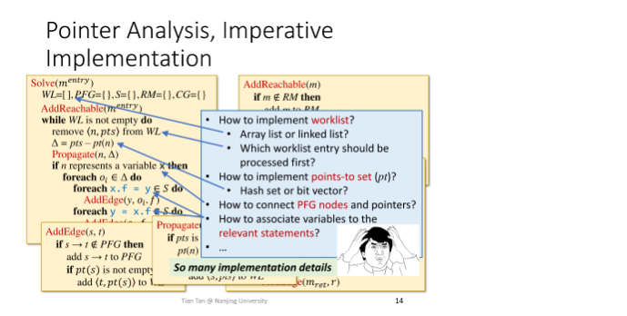

# 静态分析

## Lecture7

- **Call Graph Construction**

  **CHA**：只考虑调用点的接收者类型，解目标方法（调用图：方法内的调用点——>调用方法）

  方法内的调用点取出，对每个调用点查找对应的目标方法，**增加这个调用点到目标方法的连线，将目标方法放进队列，同时放进一个已处理方法的map，遍历过的要跳过**。构造图的时候其实是种图遍历

- **Interprocedural Control-Flow Graph**

  ICFG = CFGs + **call & return edges**    使得方法内的CFG变成方法间的CFG，其实就是让CFG里的方法调用展开了，展开之后按之前的方法数据流分析！

  *控制流图就是基于这两个原则，分割代码基本块，代码指的是IR*

  1. *只能从块的第一条指令进入。*
  2. *只能从块的最后一条指令离开。*

  *然后数据量分析基于此开始，每个块内需要有transfer function（过程间则要Node+edge）表示抽象数据的状态跳转，块前需要不同格元素的meet/join，若是 join 函数，那么我们必然会从 lattice 的最小下界往上往safe走。而越往上走，我们就会失去更多的精确值。最小下界是在最底部，最小不动点在中间，最大上界在最上面*

- **ICFG画出来后，过程间数据流分析**

  call edge transfer需要传参。Return edge transfer返回返回值，所以并不是代码直接展开而是由transfer     做大梦操大心 跟上思路 专注学术的效率

  *常量传播就是带上这个常量key-value，算是带上了数据不仅是符号，且是值传递 引用传递再说*

  node transfer就是函数调用左手边的变量要删掉（其他和过程内的transfer一样），左手边变量可以 edge transfer返回。

  - 若不覆盖，在常量传播数据流分析的理论上，本来分支上的b和transfer返回的b  join后，值不一样会NaC 丢失精度。但是本来分支不能丢，不然那些常量都得在其他调用里保存一份数据

  - 本来不分析过程间调用，则函数调用处返回都粗暴用NAC，也是丢失大片精度
  - 那么引用传递呢？

## Lecture8

CHA,只看接受者的类型,所以如果是用接口或者抽象类,则会控制流里调用过多类型的实现函数,全都返回就会使常量分析精度下降NAC

- **指针分析也能建调用图**

  还是会分析完后比实际指向的更多

  变量和对象的指针关系,

  Pointer analysis: **which** objects a pointer can point to?

  Alias analysis: **can** two pointers point to the same object?

  编译优化,静态分析的基础

  四个要素,指针分析四个问题

- Heap Abstraction

  动态执行中，由于循环和递归的结构，堆上的对象数量可以是无限的。如果不做抽象，面对无限的对象，分析算法可能根本停不下来。解决方法也很简单，学校里同学太多了就分成班级来管理，我们也可以对堆上的对象进行抽象

  相关的技术有很多，这里只讲一个最常用的分支基于存储store-based   Allocation-Site Abstraction。而Storeless的方法本课程不涉及。

  几个new处理几个分析对象

- Context Sensitivity

  调用上下文记录的是函数调用前后相关变量的值。例如，参数和返回值是上下文的一部分。

- Flow Sensitivity

  对控制流分析,每个点维护一个指向流映射(数据流信息).所以每个语句都是流敏感,重视顺序

  

  每个语句位置记录一个变量和对象的map.忽略顺序就是整个程序只有一个map

**GIT**

本地创建文件后推上git.首先github需要建仓库,然后本地init, add commit  然后添加远程仓库关联`git remote add origin git@github.com:Youngshuang/study_notes.git`,

然后推送`git push -u origin master`将本地的master分支推送到origin主机，同时指定origin为默认主机，后面就可以不加任何参数使用git push了。

若想删除暂存区`git rm -r --cached .`

若想删除远程关联`git remote remove origin `

1. 为什么要配置用户名和邮箱？

   因为Git是分布式版本控制系统，所以，每个机器都必须自报家门：你的名字和Email地址（名字和邮箱都不会进行验证），这样远程仓库才知道哪次提交是由谁完成的。你也许会担心，如果有人故意冒充别人怎么办？这个不必担心，首先我们相信大家都是善良无知的群众，其次，真的有冒充的也是有办法可查的。

2. 配置的用户名和邮箱对push代码到远程仓库有什么影响？

   首先，配置的用户名和邮箱对push代码到远程仓库时的身份验证没有作用，即不用他们进行身份验证；他们仅仅会出现在远程仓库的commits里。

   其次，按正常操作来说，你应该配置你的真实用户名和邮箱，这样一来在远程仓库的commits里可以看到哪个操作是你所为。

   最后，这个用户名和邮箱是可以随便配置的（不提倡），如果你配置的邮箱是github里真实存在的邮箱，则commits里显示的是这个邮箱对应的账号；如果配置的邮箱是一个在github里不存在的邮箱，则commits里显示的是你配置的用户名。

3. 这只是commits,真正的鉴权是ssh和https做的

   远程仓库一般支持两种协议：SSH和HTTPS，SSH协议只认机器，HTTPS协议只认账号；也即为：如果使用SSH操作远程仓库的话，我们需要使用公钥和私钥对来做权限的认证，如果使用HTTPS操作远程仓库，则需要使用账号密码来做权限的认证。无论是公钥私钥对，还是账号密码，都只做权限的认证；但是远程仓库里需要记录这些提交记录是由谁来完成的；所以我们需要给本地的git设置用户名和邮箱，用于从本地仓库向远程仓库提交记录时，在远程仓库记录下这些操作是由谁来完成的。

4. 所以想要推到哪台机器,就是推之前remote add origin指定的

## Lecture9   求证

李樾  人生导师    学完了还记得再录吧   没忘才属于不忘初心

实际zone里的快乐高于信息流颅内高潮的快乐    都忘了刚刚想了啥了

黑盒碰运气    白盒看代码人脑分析程序的过程 用数学建个模 形成统一的方法

静态分析比符号执行（符号值+逻辑表达式）比白盒fuzz（依然要靠fuzz用例暴力出数据测试）比人工黑盒高效

符号执行  符号值代替形参，原本的形参运算变成了符号的语法树，那么条件分支就变成了符号值得符合一个逻辑表达式

## Lecture13

**Information Flow Security**

- Access Control concerns how information is **accessed**.   权限，但想知道程序获得信息之后做的事情，即跟踪数据流
- Information Flow Security concerns how information is **propagated**.  更关心信息流在程序后的传播，即跟踪

If the information in variable x is transferred to variable y, then there is information flow x->y.

信息的流动就像指针分析中对象的流动

Noninterference policy——高秘密等级的信息不应该影响到低秘密等级的信息。这能够保证攻击者无法通过观测低秘密等级的信息推测出和高秘密等级的信息。secret数据不能流动到public

低秘级高秘级就是用格来建模，数学描述问题，然后用数学的性质定理方法解决问题

**Confidentiality and Integrity**

低秘级流到高秘级，会不会被污染呢

- Confidentiality(在信息流安全的语境中)侧重于防止攻击者获取到机密信息，**即保护关键数据不被攻击者读取。防读取**。可否公开，读保护

- Integrity(在信息流安全的语境中)侧重于防止攻击者通过恶意提权或SQL注入等手段执行了高执行权限的命令，**即保护关键数据不被攻击者写入。防注入**。可否信任，写保护

  准确、完整、一致

**Explicit Flows and Covert Channels**

信息在程序中流动的两种方式——显式流（按数据流的方式）和隐藏信道（没有信息流，但是控制流依赖着秘密信息  所以还是把信息传播了）。

sa[secret]=0   不仅是0的问题，secret作为下标还可以报越界报负数

显式流可能把整个数据都泄露出去，隐藏流能泄露的位数有限

**Taint Analysis**

类比于同位素标记，我们通过给关心的数据打上标记，而把数据分为tainted/untainted data.

sources——>sinks找信息流

taint data当成特殊数据，下标的i和j标识data产生的位置，提前标示sources sink方法集，初始化taintflow映射对集，污点分析和指针分析一起做可以把流经的也分析出来，方便开发处理违反安全的信息流

指针分析的过程中，遇到相应的call，输入对应的taintflow（tj，m）的映射对 这个taint数据会传到m方法中

## Lecture14

**Datalog-Based Program Analysis**

Datalog是一种声明式（Declarative）的编程语言。

命令式编程Imperative VS声明式编程Declarative

> Imperative   如CPP、Java   实现详细像给计算机下命令，即怎么做
>
> Declarative   如SQL   只是说了要做什么，就是底部有个引擎解析，相当于只写.h不写.cpp    SQL有引擎 datalog也有引擎LogicBlox

如果用Imperative的编程方式做指针分析，很麻烦。



**Introduction to Datalog**

接下来学习一个船新的语言——Datalog，它实际上是大名鼎鼎的Prolog的一个子集。

```
Datalog=Data+Logic(and,or,not)
```

- 没有副作用   赋值、修改
- 没有控制流   分支、循环
- 没有函数
- 不是图灵完备的

*命题逻辑是纯关系运算，谓词引入了集合  域内运算     谓词就是个域内函数、关系，限定了一个范围*，也可以看成数据组成的一个表，每一行是个fact

谓词是一个元组

原子是最小不可拆分部分，关系型原子：谓词名词（参数）   算术型原子age >= 18

规则：用来推导，逻辑表达式，当Body中的所有表达式都为True时，Head才为True。子表达式间都是and，相同头部那就是或运算或者用分号。与运算由新阿基总是更高的，取非 即这个组合不在谓词C里

谓词分为两类：EDB & IDB。

- EDB (extensional database)
  - 在程序运行前，这些数据已经给定
- IDB (intensional database)
  - 这一类数据仅由规则推导得来，相当于程序输出

datalog比SQL强就强在能递归

```
A(x) <- B(y), x > y.
```

```
A(x) <- B(y), !C(x,y).
```

由于x有无限的取值能满足规则，所以**生成的A是一个无限大的关系**。因此上述两条规则是不安全的。在Datalog中，只接受安全的规则。x需要放在谓词这个域里面，不在C里面的x y 以及在B里的y，这个约束没管到x。**（就和谓词逻辑的任意会让计算机无法SAT）**

这里我们需要记住一个判定的准则：**如果规则中的每个变量至少在一个non-nageted relational atom中出现一次，那么这个规则是安全的**。

> 为什么程序分析总是要用到逻辑运算？

Datalog的两大重要特性：

- 单调性。因为事实（facts）不会被删除的。
- 必然终止。所以图灵不完备
  - 事实的数量是**单调**的。
  - 由Rule Safety，所能得到的IDB的大小也是**有限**的。

指针分析里，EDB就是new语句，其他的varpointto都是由new 的来的。谓词都是按需求按命令式的逻辑自己定的
